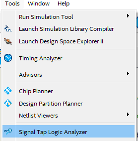
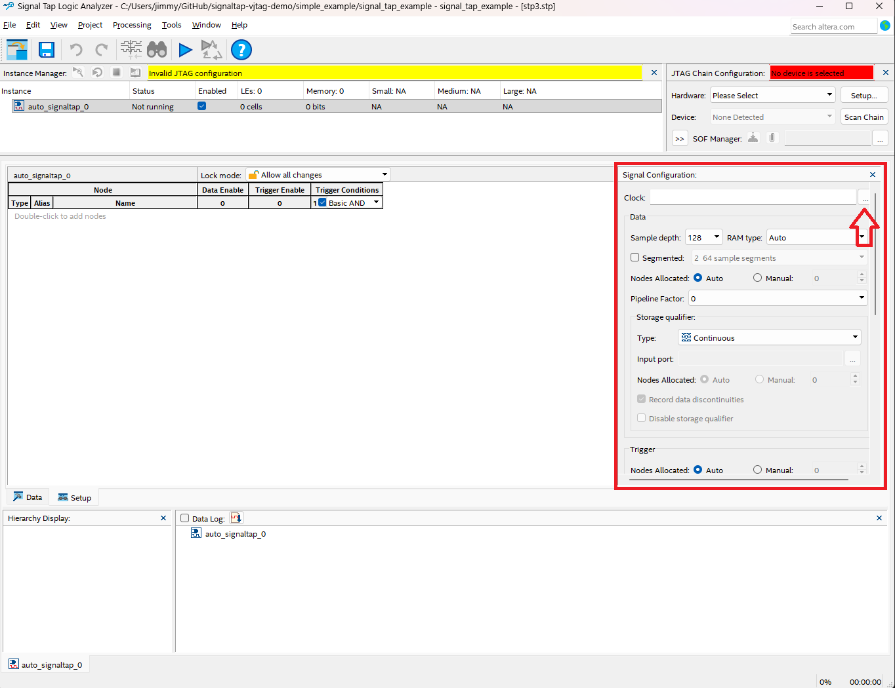
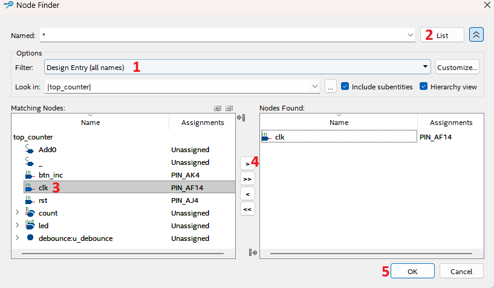
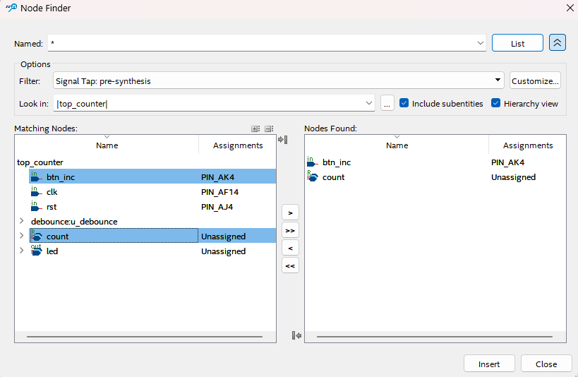
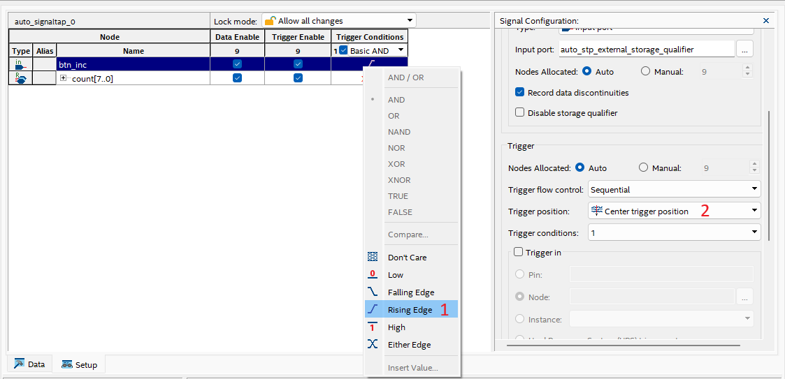
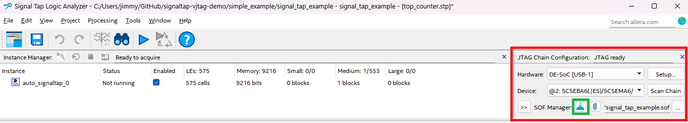
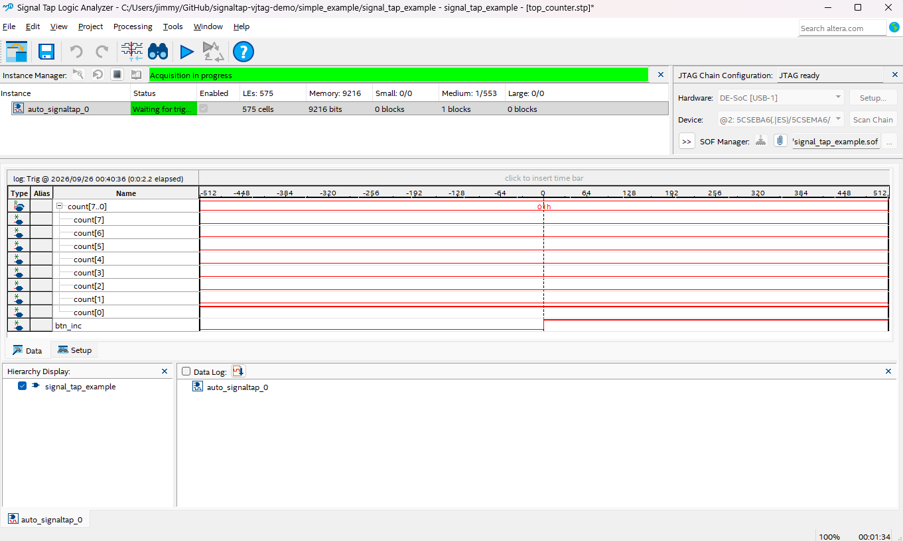

# Signal Tap Logic Analyzer - Ejemplo con contador de 8 bits

> **Carpeta:** `simple_example/`  
> **Diseño:** Contador de 8 bits incrementado con botón físico y debounce por FSM

---

## ¿Qué es Signal Tap?

Signal Tap es el **analizador lógico embebido** de Quartus Prime. Permite capturar señales internas de la FPGA en tiempo real a través del mismo cable JTAG que se usa para programar, sin necesidad de pines adicionales ni equipo externo.

---

## Diseño de ejemplo

### `debounce.sv` - FSM de 4 estados

El módulo de debounce filtra los rebotes mecánicos del botón. Su salida `out` es un **pulso limpio de exactamente 1 ciclo de reloj**, lo que lo hace ideal como trigger en Signal Tap.

### `top_counter.sv` - Top level


**Señales internas de interés para Signal Tap:**

| Señal | Módulo | Descripción |
|-------|--------|-------------|
| `btn_inc` | `top_counter` | Pulso de 1 ciclo al presionar -> **usar como trigger** |
| `count[7:0]` | `top_counter` | Valor actual del contador |

---

## Flujo completo de Signal Tap

### Paso 1 - Abrir Signal Tap

```
Tools -> Signal Tap Logic Analyzer
```




Cuando Quartus pregunte si agregar el `.stp` al proyecto, responder **Yes**. Guardar como `signaltap/top_counter.stp`.

> El archivo `.stp` preconfigurado ya está en `signaltap/top_counter.stp`. Si se abre directamente, saltar al Paso 5.

---

### Paso 2 - Configurar el analizador

En la sección **Signal Configuration** (panel derecho o central):

**Clock de muestreo:**
1. Clic en `...` junto al campo **Clock**.
2. En Node Finder: Filter -> `Design Entry (all names)`, darle click a `List`.
3. Buscar `clk`, seleccionarlo con `>`, clic **OK**.





> El clock de Signal Tap debe ser el mismo que sincroniza las señales capturadas.

**Sample depth:** seleccionar **1K** (1 024 muestras).

**RAM type:** dejar en **Auto**.

---

### Paso 3 - Agregar señales

Doble clic en el área vacía de la lista de nodos, o usar **[+] -> Add Nodes...**

En el **Node Finder**:
- Filter: `Signal Tap: pre-synthesis`
- Look in: `|top_counter|`
- Clic en **List**

Seleccionar y mover con `>`:

| Señal | Cómo encontrarla |
|-------|-----------------|
| `count[7:0]` | Nivel top `top_counter` |
| `btn_inc` | Nivel top `top_counter` |

Clic en **Insert** -> **Close**.



### Paso 4 - Configurar el trigger

El **trigger** determina qué condición en las señales evaluadas iniciará la captura de datos en la memoria RAM de la FPGA.

#### 1. Opciones de Trigger Condition

En la columna **Trigger Conditions**, se puede hacer clic derecho sobre cualquier señal para configurar una de las siguientes reglas de disparo:

| Opción | Descripción | Caso de Uso Recomendado |
| :--- | :--- | :--- |
| **Don't Care** | Ignora la señal para la condición de disparo. | Señales que solo se quieren observar o medir, pero que no determinan cuándo iniciar la captura. |
| **Low** | Se dispara continuamente mientras la señal se mantenga en nivel bajo (`0` lógico). | Detección de señales activas en bajo (p. ej., señales `reset_n` o `enable` activas en 0). |
| **High** | Se dispara continuamente mientras la señal se mantenga en nivel alto (`1` lógico). | Monitorear el estado activo de habilitadores o banderas (*flags*) permanentes. |
| **Rising Edge** | Se dispara en la transición exacta de `0` a `1` (flanco de subida). | Capturar eventos puntuales o pulsos únicos, como presionar un botón o el inicio de una transacción SPI/UART. |
| **Falling Edge** | Se dispara en la transición exacta de `1` a `0` (flanco de bajada). | Interrupciones o liberación de botones/señales activas en bajo. |
| **Either Edge** | Se dispara en cualquier cambio de estado (`0` -> `1` o `1` -> `0`). | Monitoreo de líneas de datos toggling o transiciones de reloj/conmutación. |

> **Configuración en este ejemplo:** Para la señal `btn_inc`, selecciona **Rising Edge**. Dado que `btn_inc` permanece en `0` y solo sube a `1` durante 1 ciclo al presionar el botón, el flanco de subida es el evento preciso para congelar la ventana de tiempo.

#### 2. Configuración de Trigger Position

La opción **Trigger Position** define la ventana temporal que se almacenará en el buffer de muestras respecto al momento exacto en que ocurre el disparo:

* **Pre Trigger:** Asigna el **12%** de las muestras a eventos ocurridos *antes* del disparo y el **88%** a lo que sucede *después*. Ideal para analizar la respuesta posterior a un evento.
* **Center (50%):** Divide la memoria en **50% previo** y **50% posterior** al disparo. Permite analizar las causas que provocaron el evento y su comportamiento inmediatamente después.
* **Post Trigger:** Almacena el **88%** de las muestras de eventos ocurridos *antes* del disparo y un **12%** posterior. Recomendado para depurar errores impredecibles o fallos previa activación de una condición.

> **Configuración en este ejemplo:** Selecciona **Center (50%)**. Con un *Sample depth* de 1K (1024 muestras), se capturarán **512 muestras antes** y **512 muestras después** de presionar el botón.



---

### Paso 5 - Compilar

Guardar el `.stp` (File -> Save dentro de Signal Tap), luego compilar el proyecto completo:

```
Processing -> Start Compilation 
```

Signal Tap se inserta en el diseño durante la compilación. 

> **Importante:** el `.stp` debe estar activo (incluido en el `.qsf`) **antes** de compilar. Si se modifica el diseño y se recompila, el `.stp` debe acompañar al nuevo build.

---

### Paso 6 - Programar la FPGA

1. En Signal Tap, campo **Hardware** (esquina superior derecha) -> cargar fpga.
2. En **SOF Manager** -> cargar `output_files/<proyecto>.sof`.
3. Clic en **Program Device** (cuadro verde).



---

### Paso 7 - Capturar

**Iniciar adquisición:**

| Botón | Función |
|-------|---------|
| Run Analysis | Captura una vez al disparar el trigger |
| Autorun Analysis | Captura continua, ideal para observar eventos repetitivos |
| Stop | Detiene |

Clic en **Autorun Analysis**. La barra mostrará `Waiting for trigger...`

**Presionar el botón físico (KEY)** en la placa.

---

## Interpretación de la captura

Con el trigger configurado en **Rising Edge de `btn_inc`** y posición en **Center (50%)**:



### Análisis de la forma de onda

1. **Línea de tiempo (Muestra 0 - Instante del Trigger):**
   * En el centro del gráfico (marcado con la línea punteada vertical en la muestra `0`), se observa el flanco de subida de la señal `btn_inc` (pasa de `0` a `1`).
   * **Antes de `t = 0` (muestras -512 a -1):** El sistema muestra el estado guardado en el buffer antes de presionar el botón.
   * **Después de `t = 0` (muestras 1 a 512):** Muestra el comportamiento del circuito tras detectar la pulsación.

2. **Comportamiento del Contador (`count[7..0]`):**
   * **Antes de `t = 0`:** El bus `count[7..0]` se mantiene en el valor `00h` (se aprecia en la línea `count[0]` en alto y `count[1]` en alto, representando el valor `01h` en hexadecimal marcado como `01h` justo en el punto de disparo).
   * **En `t = 0`:** Al detectarse el pulso de `btn_inc`, el bus del contador `count[7..0]` pasa inmediatamente de `00h` a `01h`.

---

## Referencia

- [Quartus Prime 18.1 — Signal Tap Logic Analyzer User Guide](https://www.intel.com/content/www/us/en/docs/programmable/683819/18-1/using-the-signal-tap-logic-analyzer.html)